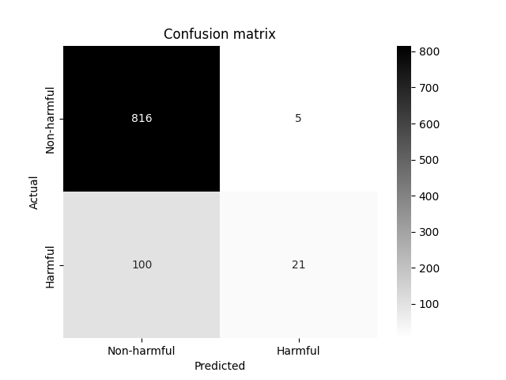
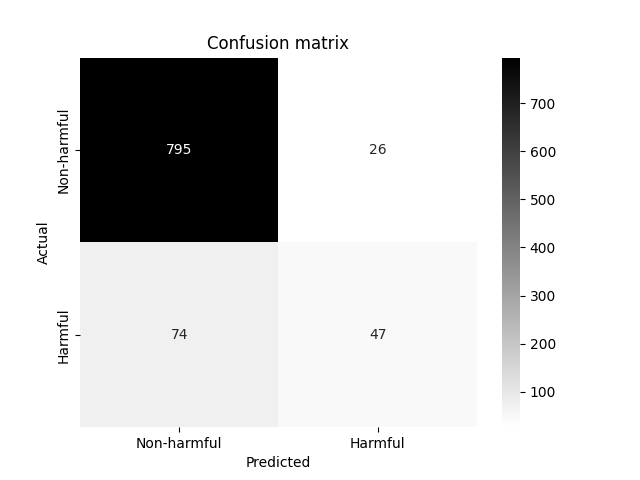
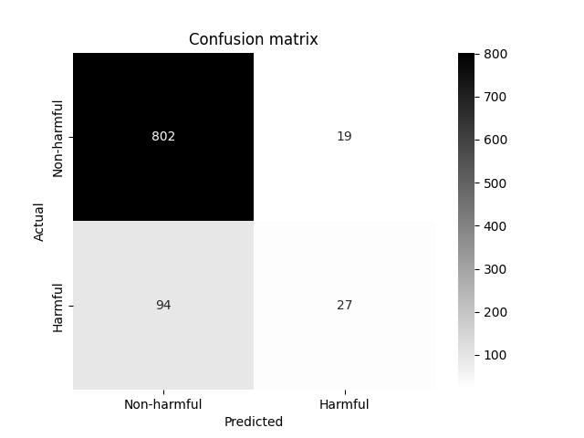
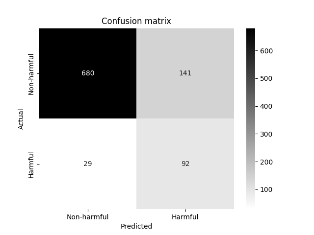

# Cyberbullying-detection
## Based on PolEval 2019 Task 6: Automatic Cyberbllying detection

#### http://2019.poleval.pl/index.php/tasks/task6

## This project is based only on Task 6-1: Harmful vs non-harmful

#### Results after preprocessing:
``` 
class of tweets     training set    testing set

non-harmful             8608            821
harmful                  753            121
```

### Results of SVC classifier:
##### Acc score: 88.85%

```
                precision    recall  f1-score   support

0-non-harmful       0.89      0.99      0.94       821
1-harmful           0.81      0.17      0.29       121

    accuracy                            0.89       942
   macro avg        0.85      0.58      0.61       942
weighted avg        0.88      0.89      0.86       942
```
##### Strengths:
 - Good overall accuracy <br>
 - High precision and recall for non-harmful class.
##### Weaknesses:
 - Limited recall for harmful class, indicating challenges in identifying harmful tweets <br>
 - Biased towards the majority class (non-harmful).

### Results of SVC classifier with class_weight='balanced':
##### Acc score: 89.38%

```
               precision    recall  f1-score   support

           0       0.91      0.97      0.94       821
           1       0.64      0.39      0.48       121

    accuracy                           0.89       942
   macro avg       0.78      0.68      0.71       942
weighted avg       0.88      0.89      0.88       942
```
##### Improvements:
 - Improved recall for harmful class <br>
 - Balanced class weights address bias, resulting in better overall performance.
##### Challenges:
 - Limited precision and recall for harmful class
### Results of Multinominal Naive Bayes classifier:
##### Acc score:  87.9%

```
Classification report:
               precision    recall  f1-score   support

           0       0.88      1.00      0.93       821
           1       0.77      0.08      0.15       121

    accuracy                           0.88       942
   macro avg       0.82      0.54      0.54       942
weighted avg       0.87      0.88      0.83       942
```
##### Observations:
 - Good precision for non-harmful class <br>
 - Limited recall and precision for harmful class
##### Challenges:
 - Struggles to capture harmful tweets effectively
### Results of Multilayer Perceptron classifier:
##### Accuracy score:  88%

```
Classification report:
               precision    recall  f1-score   support

           0       0.90      0.98      0.93       821
           1       0.59      0.22      0.32       121

    accuracy                           0.88       942
   macro avg       0.74      0.60      0.63       942
weighted avg       0.86      0.88      0.86       942
```
##### Strengths:
 - High precision for non-harmful class <br>
 - Balanced precision and recall for harmful class
##### Challenges:
 - Moderate recall for harmful class, indicating room for improvement
### Results of Gradient Boosting Machines classifier:
##### Accuracy score:  87.9%

```
Confusion matrix:
                     predicted:
actual:                            positive      negative
       positive                      821            0
       negative                      114            7
```
```
Classification report:
               precision    recall  f1-score   support

           0       0.88      1.00      0.94       821
           1       1.00      0.06      0.11       121

    accuracy                           0.88       942
   macro avg       0.94      0.53      0.52       942
weighted avg       0.89      0.88      0.83       942
```
##### Observations:
 - Excellent precision for non-harmful class <br>
 - Struggles with recall for harmful class
##### Challenges:
 - Imbalanced recall, especially for harmful tweets
## SetFit
https://huggingface.co/docs/setfit/index

All models to train were taken from huggingface.co leaderboard:
https://huggingface.co/spaces/mteb/leaderboard

### Results of SetFit with st-polish-kartonberta-base-alpha-v1:
https://huggingface.co/OrlikB/st-polish-kartonberta-base-alpha-v1

###### num_samples = 20 <br>
###### batch_size = 128 <br>
###### num_epochs = 10 <br>
###### Total optimization steps = 70 <br>

##### Accuracy score:  82.8%

```
Confusion matrix:
                     predicted:
actual:                            positive      negative
       positive                      680           141
       negative                      29            92
```
```
Classification Report:
               precision    recall  f1-score   support

           0       0.96      0.83      0.89       821
           1       0.39      0.76      0.52       121

    accuracy                           0.82       942
   macro avg       0.68      0.79      0.70       942
weighted avg       0.89      0.82      0.84       942
```
##### Strengths:
 - Good precision for harmful class
 - Balanced precision and recall for non-harmful class

##### Challenges:
 - Limited recall for harmful class
###### num_samples = 50 <br>
###### batch_size = 128 <br>
###### num_epochs = 10 <br>
###### Total optimization steps = 400 <br>

##### Accuracy score:  83.8%

```
Classification Report:
               precision    recall  f1-score   support

           0       0.97      0.80      0.88       821
           1       0.39      0.83      0.53       121

    accuracy                           0.81       942
   macro avg       0.68      0.82      0.70       942
weighted avg       0.90      0.81      0.83       942
```
##### Strengths:
 - Improved accuracy with num_samples = 50
 - Model maintains good precision for harmful class

##### Challenges:
 - Suitable for applications where balance between this two classes is important
### Results of SetFit with st-polish-paraphrase-from-mpnet:
https://huggingface.co/sdadas/st-polish-paraphrase-from-mpnet

###### num_samples = 20 <br>
###### batch_size = 128 <br>
###### num_epochs = 10 <br>
###### Total optimization steps = 70 <br>

##### Accuracy score:  73.2%

```
Classification Report:
               precision    recall  f1-score   support

           0       0.96      0.76      0.85       821
           1       0.32      0.79      0.46       121

    accuracy                           0.76       942
   macro avg       0.64      0.77      0.65       942
weighted avg       0.88      0.76      0.80       942
```
##### Observations:
- Struggles with precision for harmful class
- Moderate recall for harmful class

##### Challenges:
- Less effective in identifying harmful tweets

    Less effective in identifying harmful tweets
### Results of SetFit with mmlw-roberta-base:
https://huggingface.co/sdadas/mmlw-roberta-base
###### num_samples = 20 <br>
###### batch_size = 128 <br>
###### num_epochs = 10 <br>
###### Total optimization steps = 70 <br>

##### Accuracy score:  76.4%

```
Classification Report:
               precision    recall  f1-score   support

           0       0.97      0.78      0.86       821
           1       0.35      0.83      0.50       121

    accuracy                           0.78       942
   macro avg       0.66      0.80      0.68       942
weighted avg       0.89      0.78      0.82       942
```
##### Strengths:
 - Improved recall for harmful class
##### Challenges:
 - Limited precision for harmful class
### Results of SetFit with mmlw-roberta-large:
https://huggingface.co/sdadas/mmlw-roberta-large
###### num_samples = 12 <br>
###### batch_size = 128 <br>
###### num_epochs = 10 <br>
###### Total optimization steps = 30 <br>

##### Accuracy score:  71.2%

```
Classification Report:
               precision    recall  f1-score   support

           0       0.97      0.71      0.82       821
           1       0.30      0.85      0.45       121

    accuracy                           0.73       942
   macro avg       0.64      0.78      0.64       942
weighted avg       0.88      0.73      0.77       942
```
##### Observations:
 - Struggles with recall for non-harmful class
 - Limited precision for harmful class

##### Challenges:
 - Lower overall accuracy, indicating room for improvement
#### Augmentation:

https://neptune.ai/blog/data-augmentation-nlp

There was a plan to use back translation of harmful tweets polish->english->polish, but it didn't work well.

Also other augmentation methods from article above were planned to use,
but dataset was hard to augment, because of the language and not many
synonyms of curse words in polish language.

## Overall Conlusions:
 - **Class Imbalance:** Majority of models show bias towards the non-harmful class due to its larger size.
 - **Harmful Class Identification:** Across various models, identifying harmful tweets remains a challenge, with limited recall and precision.
 - **SetFit Models:** Exhibit varying performance; tuning hyperparameters and exploring different models may lead to improvements.
 - **Augmentation Challenges:** Limited effectiveness due to language constraints in Polish.

[//]: # (- back translation of harmful tweets polish->english->polish)

[//]: # ()
[//]: # (Acc score: 88.21%)

[//]: # (```)

[//]: # (                predicted: )

[//]: # (actual:                         postive  negative)

[//]: # (       positive                   818       3)

[//]: # (       negative                   108      13)

[//]: # (```)

[//]: # ()
[//]: # (```)

[//]: # (                precision    recall  f1-score   support)

[//]: # ()
[//]: # (0-non-harmful       0.88      1.00      0.94       821)

[//]: # (1-harmful           0.81      0.11      0.19       121)

[//]: # ()
[//]: # (    accuracy                            0.88       942)

[//]: # (   macro avg        0.85      0.55      0.56       942)

[//]: # (weighted avg        0.87      0.88      0.84       942)

[//]: # (```)

[//]: # (- f1 is lower than without augmentation)


